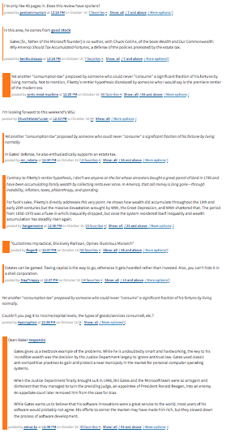
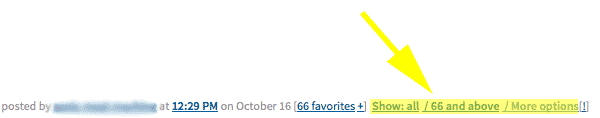

# MetaFilter Filter By Favorites by Jonathan Gordon

## Description

Allows a user to select MetaFilter comments they wish to view based on how many times it has been favorited. This
script currently only works for the "modern" theme, selectable via your MetaFilter profile preferences. It works with
the following MetaFilter subsites:

+ www
+ ask
+ metatalk
+ fanfare
+ projects
+ music
+ irl

## Version 1.0

This userscript is hosted at https://greasyfork.org/scripts/5717-metafilter-filter-by-favorites

It is synced with this github location: https://github.com/jonathanpdx/MetaFilterFilterByFavorites

## Usage

To use this script, install via Greasemonkey. If you have Greasemonkey installed, downloading the script via your
browser should prompt for install.

## Suggestions

If you have any suggestions as to how you'd like this script to differently, please don't hesitate to ask!

### Features

#### Comments/Favorites graph

At the top of any page which has more than one comment, a graph should appear showing how many comments have been
made with a minimum threshold of favorites. Clicking on any bar on the graph will filter the display of comments that
have at least that many favorites.

#### Show weighted favorite bar next to each comment.

Each comment has a bar next to it, with the width growing in proportion to the number of times its been favorited.

#### Show: All / X and above / More options

Three additional links will appear next to each comment's favorite count allowing you to filter comments in-place,
with the "More options" link providing a convenience link to return to the top of the post and view the graph.

#### Hotkey(s)

Currently the only hotkey configured is [ALT + g] which is the equivalent of clicking "Show all".

## Special Thanks

Special thanks to Jordan Reiter and Jimmy Woods for their previous work on MetaFilter favorite user scripts,
on which this work is heavily based.
